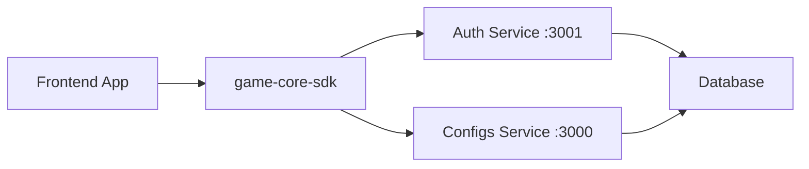

# Quick Start Guide

## 1. Build the SDK

```bash
cd /home/pc/Gambling/game-core-sdk
npm install
npm run build
```

## 2. Install in Frontend

```bash
cd /home/pc/Gambling/game-core-sdk-frontend
npm install ../game-core-sdk
```

## 3. Basic Usage

```javascript
import { coreSDK } from 'game-sdk';

async function initAndTest() {
  // Initialize with separate service URLs
  await coreSDK.init({
    app: 'ai-games-platform',
    version: '1.0.0',
    baseUrl: 'http://localhost:3000',    // Configs service
    authUrl: 'http://localhost:3001',     // Auth service
  });

  console.log('SDK initialized!');
```

## 4. Available Clients

All clients are accessible via `coreSDK`:

```javascript
coreSDK.configs       // Configuration management
coreSDK.kv       // key value storage
```

## 5. Start Backend Services

Make sure the backend services are running:

```bash
# Auth service (port 3001)
cd /home/pc/Gambling/ai-games-platform/auth
npm run start:dev

# Configs service (port 3000)
cd /home/pc/Gambling/ai-games-platform/configs
npm run start:dev
```

API endpoints:
- Auth API: `http://localhost:3001/v1/auth/*`
- Configs API: `http://localhost:3000/v1/configs/*`
- Swagger docs: `http://localhost:3000/api/docs`

## 6. Start Frontend

```bash
cd /home/pc/Gambling/game-core-sdk-frontend
npm start
```

Frontend will be available at: `http://localhost:5000`

## Complete Flow



## SDK Files

- [src/CoreSDK.ts](src/CoreSDK.ts) - Main SDK class
- [src/types.ts](src/types.ts) - TypeScript types
- [src/api-types.ts](src/api-types.ts) - API request/response types
- [src/clients/AuthApiClient.ts](src/clients/AuthApiClient.ts) - Auth client
- [src/clients/ConfigsApiClient.ts](src/clients/ConfigsApiClient.ts) - Configs client
- [src/clients/AbTestsApiClient.ts](src/clients/AbTestsApiClient.ts) - A/B Tests client
- [src/clients/RemoteConfigsApiClient.ts](src/clients/RemoteConfigsApiClient.ts) - Remote configs
- [src/clients/SegmentsApiClient.ts](src/clients/SegmentsApiClient.ts) - Segments client
- [src/clients/UsersApiClient.ts](src/clients/UsersApiClient.ts) - Users client
- [src/clients/HealthApiClient.ts](src/clients/HealthApiClient.ts) - Health client
- [src/config.ts](src/config.ts) - SDK configuration (baseUrl, authUrl)
- [src/index.ts](src/index.ts) - Exports

## Documentation

- [API_USAGE.md](API_USAGE.md) - Complete API reference
- [FRONTEND_INTEGRATION.md](FRONTEND_INTEGRATION.md) - React integration

## UMD Build (Browser)

```html
<!-- Load SDK via script tag -->
<script src="/game-sdk.umd.js"></script>
<script>
  const sdk = window.coreSDK;
  sdk.init({
    app: 'my-game',
    baseUrl: 'http://localhost:3000',
    authUrl: 'http://localhost:3001'
  }).then(() => {
    console.log('SDK ready');
  });
</script>
```

---

**Last Updated**: December 2025
**Version**: 1.0.20
